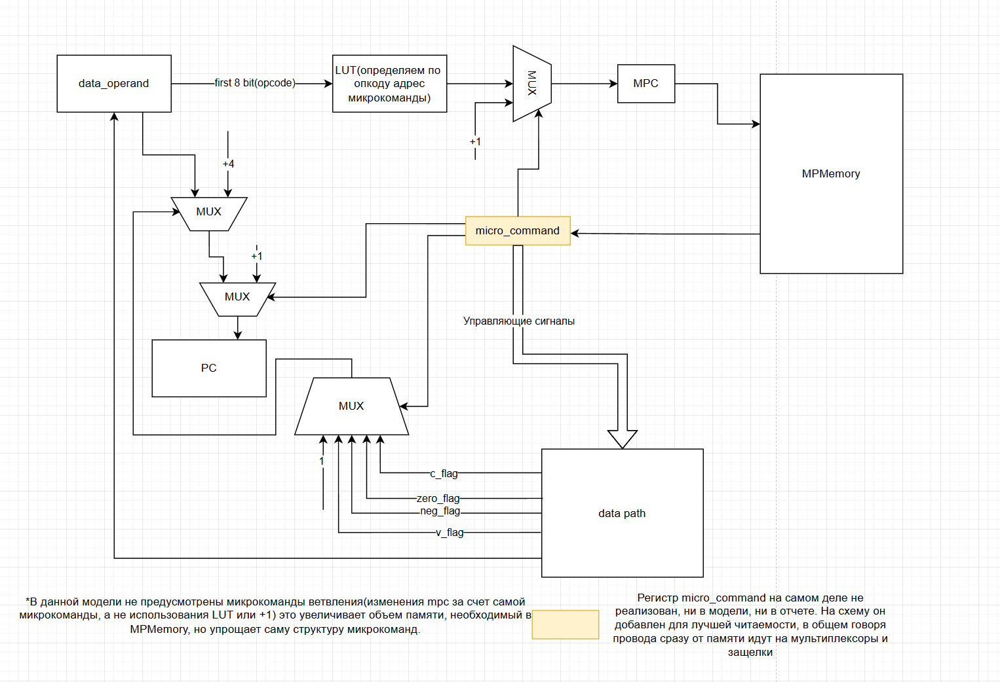
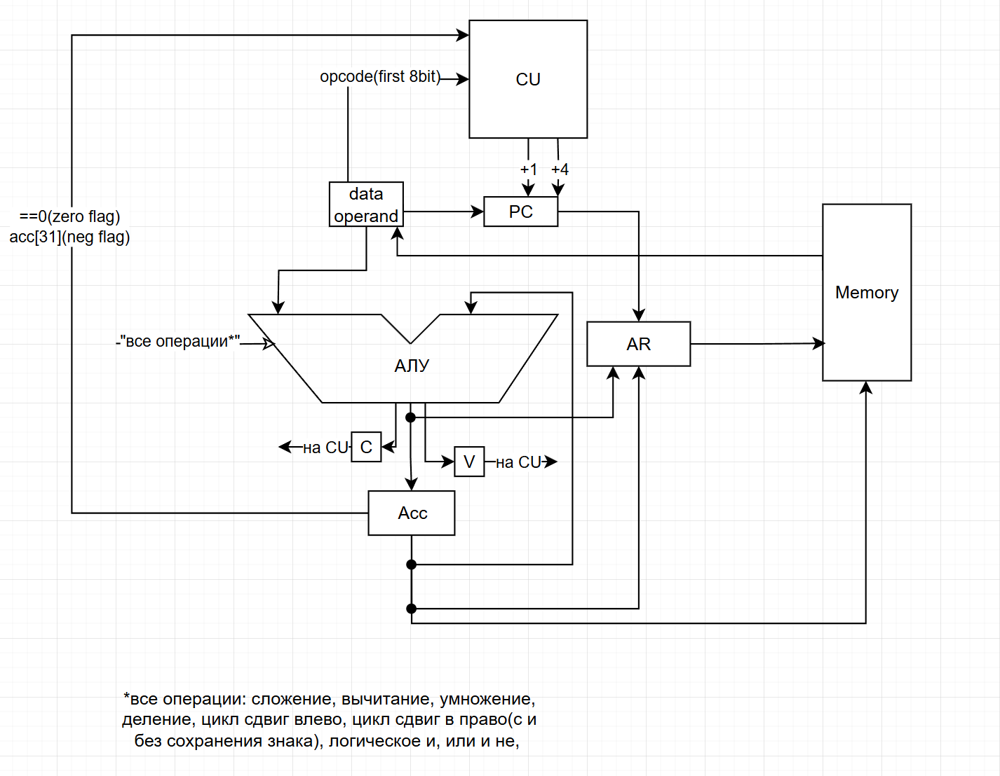

# csa-lab4
# Laboratory work № 4. Experiment
Алексеев Павел Сергеевич, P3219
- Вариант: `asm | acc | neum | mc | tick | binary | stream | mem | pstr | prob2 | cache`
- Расшифровка варианта:
  - `asm`: синтаксис ассемблера. Необходима поддержка label-ов, секций и директивы .org. Поддержка пользовательских макроопределений.
  - `stack`: система команд должна быть выстроена вокруг аккумулятора
  - `neum`: фон Неймановская архитектура.
  - `mc`: microcoded.
  - `tick`: процессор необходимо моделировать с точностью до такта, процесс моделирования может быть приостановлен на любом такте.
  - `binary`: бинарное представление
  - `stream`: Ввод-вывод осуществляется как поток токенов.
  - `port`: memory-mapped (порты ввода-вывода отображаются в память и доступ к ним осуществляется штатными командами)
  - `pstr`: Length-prefixed (Pascal string)
  - `prob2`: Find the difference between the sum of the squares of the first one hundred natural numbers and the square of the sum.

    
## Язык программирования
### Синтаксис
```

<program> ::= <line>*

<line> ::= <label> <comment>? "\n"
        | <label> <data>
        | <macro>
        | <directive> <comment>?
        | <instr> <comment>? "\n"
        | <comment> "\n"

<macro> ::= "#def" <target> <arg_count> <code> "#enddef"
<target> ::= <string>
<arg_count> ::= <positive_integer>
<code> ::= <line>*

<directive> ::= ".data"
        | ".text"
        | ".org" <positive_integer>

<label> ::= <label_name> ":"

<data_type> ::= ".num" <integer>
        | ".byte" '<string>'

<instr> ::= <op0>
         | <op1> " " <label_name>

<op0> ::= "not"
    | "halt"

<op1> ::= "read"
     | "write"
     | "read_ind"
     | "write_ind"
     | "add"
     | "sub"
     | "mul"
     | "and"
     | "or"
     | "beq"
     | "bne"
     | "bvs"
     | "bcs"
     | "jump"
     | "mul_high"

<positive_integer> ::= [0-9]+

<lowercase_letter> ::= [a-z]
<uppercase_letter> ::= [A-Z]
<letter> ::= <lowercase_letter> | <uppercase_letter>
<integer> ::= "-"? [0-9]+
<string> ::= <letter> <letter_or_digit_or_underscore>*

<letter_or_digit> ::= <letter> | [0-9]
<letter_or_digit_or_underscore> ::= <letter_or_digit> | "_"

<label_name> ::= <letter> <letter_or_digit_or_underscore>*

<comment> ::= " "* ";" <comment_text>?
<comment_text> ::=  " "* <letter_or_digit_or_underscore> ( " " <letter_or_digit_or_underscore> )*

```
### Семантика
- Стратегия вычислений - аккумуляторная.
- Одноадресные или безадресные команды: Инструкции имеют один явный операнд (метку), второй операнд — всегда аккумулятор(или инструкция взаимодействует только с аккумулятором).
- Сначала код полностью транслируется, потом последовательно выполняется.
- Область видимости: все переменные и все функции доступны везде.
- В секции .data указываются переменные: у каждой есть label, тип переменной и ее значение. Для численных переменных тип .num, значение - число от -2^31 до 2^31-1, для строковых - тип .byte, потом в одинарных кавычках строка любой длины.
- В секции .text помещается исполняемый код, состоящий из labelов, инструкций и их аргументов(других labelов)
- В любой строке кода может быть помещена директива .org <число> что позволит сдвинуть адрес записи команды или переменной вперед по памяти на указанное количество байт
- Язык также поддерживает макроопределения вида #def target num_of_args value #enddef, где target - заменяемая в коде конструкция(одно ключевое слово), num_of_args - количество аргументов передаваемых для распаковки, и value - кусок кода, который будет вставлен всесто target(указанные переменные поместятся вместо %i, где i - номер переменной)
- Код всегда будет начинать выполнение с метки `_start:`, если ее нет, транслятор выдаст ошибку


## Организация памяти

### Общие положения
* Вся внешняя память - статическая, SRAM. В модели размер памяти - имзменяемое значение, в рабочей версии выставленно 2**16 байт
* Адресация – прямая абсолютная, в некоторых командах используется косвенная. Так как аргументом команды может служить только label, при трансляции он переводится в абсолютный адрес.Но такие команды как read_ind и write_ind осуществляют косвенную адресацию
* Программа и данные хранятся в общей памяти согласно
  архитектуре Фон-Неймановского процессора.
  Программа состоит из
  набора инструкций и меток, последняя инструкция – `HALT`.
* Операция записи в память перезапишет ячейку памяти как ячейку с данными.
  Программист имеет доступ на чтение/запись в
  любую ячейку памяти. Также он может управлять и иметь доступ к содержимому аккумулятора
* Размер машинного слова - 4 байта
* Инструкции хранятся в основной памяти вместе с данными, механика макроопределений заменяет процедуры, прерывания не предусмотрены
* В реализации нет разделения на статические и динамические данные, любая область памяти может быть изменена
* Также в модели процессора есть отдельные структуры, реализуемые схемотехнически с помощью памяти - память микрокоманд и таблица LUT для определения адреса микрокоманды, их реализацию см. ниже

### Работа с литералами
* В начале программы должна располагаться секция .data, в которой должны быть указаны переменные (пример формата: const_1  .num  1)
* Таким образом в данные пишутся значения переменных, они записываются в память начиная с 8 байта(первые 8 байт заняты под потоки ввода-вывода, подробности см. ниже)
* Данные записываются в память последовательно без пробелов: данные .num занимают 4 байта, данные .byte занимают столько байт, сколько в переданной строке символов
* в секции .text располагается исполняемая программа, в аргументы команд можно передавать только существующие labelы, на этапе трансляции они будут преобразованы в абсолютный адрес байта, на который они указывают

## Система команд

### Особенности процессора:
* Доступ к памяти осуществляется по адресу из специального регистра.
  Значение в нем может быть защелкнуто либо из PC, либо из Аккумулятора, либо из выхода из АЛУ
* Типы данных - .num (32-х битный int) и .byte (строка произвольной длины, состоящая из символов ascii)
* Устройство памяти и адресации освещено выше, Регистры:
  * ACC - 32-x битный регистр, доступен программисту, через него происходят практически все операции
  * AR - 32-x битный регистр, Вспомогательный регистр для осуществления доступа к памяти
  * data_operand - 32-x битный регистр, Вспомогательный регистр для записи в него значений из памяти
  * PC - 32-x битный регистр, Регистр, показывающий адрес текущий команды(в некоторых случаях ее операнда)
  * MPC - 8-ми битный регистр, необходим для узазания на следующую исполняемую микрокоманду
* Устройство ввода-вывода:
  * ввод-вывод реализован через MMIO - по адресу 0 расположен поток ввода, по адресу 4 расположен поток вывода, при обращении к ним(посредством косвенной адресации как правило) пользователь может получить данные из ввода(или записать данные в вывод) или получить ообщение, что в буффере не осталось данных для чтения.
  * Буффер может содержать только численные данные. Символьные данные автоматически приводятся к численному виду в процессе запускма симуляции
* Процессор реализован с использованием микрокоманд. Каждый такт читается и исполняется одна микрокоманда. Процесс останавливается только в случае получения инструкции halt(или при выходе за допустимый лимит тиков)
* После выполнения каждой инструкции pc указывает на следующую исполняемую инструкцию. Он может быть инрементирован(+1 или +4) или в него может быть записан адрес метки после перехода
* Система прерываний не предусмотрена
### Набор инструкций:

`not` – Логически инвертирует аккумулятор. ~acc -> acc. 2 такта  <br>
`halt` – остановка тактового генератора. halt. 1 такт<br>
`read {label}` – Читает значение из памяти(по переданной метке) в аккумулятор. mem[addr] -> acc. 6 тактов <br>
`write {label}` – Записывает значение из аккумулятора в память(по переданной метке). acc -> mem[addr]. 4 такта <br>
`read_ind {label}` – Читает значение из памяти(по переданной метке) и записывает в аккумулятор значение по этому адресу(mem[mem[addr]] -> acc). 8 тактов <br>
`write_ind {label}` – Читает значение из памяти(по переданной метке) и записывает по этому адресу значение аккуммулятора (mem[mem[addr]] <- acc). 6 тактов<br>
`add {label}` - прибавляет к аккумулятору значение расположенное по адресу метки и записывает результат в аккумулятор. mem[addr] + acc -> acc. 6 тактов <br>
`sub {label}` - вычитает из аккумулятора значение расположенное по адресу метки и записывает результат в аккумулятор. -mem[addr] + acc -> acc. 6 тактов <br>
`mul {label}` - умножает аккумулятор на значение расположенное по адресу метки и записывает младшие 4 байта результата в аккумулятор. mem[addr] * acc -> acc. 6 тактов <br>
`mul_high {label}` - умножает аккумулятор на значение расположенное по адресу метки и записывает старшие 4 байта результата в аккумулятор. mem[addr] * acc << 32 -> acc. 6 тактов <br>
`and {label}` - логически умножает аккумулятор на значение расположенное по адресу метки и записывает результат в аккумулятор. mem[addr] & acc -> acc. 6 тактов <br>
`or {label}` - логически складывает аккумулятор на значение расположенное по адресу метки и записывает результат в аккумулятор. mem[addr] | acc -> acc. 6 тактов<br>
`beq {label}` - осуществляет переход по адресу метки если в аккумуяторе число равное 0. (if acc == 0) addr -> pc. 4 такта <br>
`bne {label}` - осуществляет переход по адресу метки если в аккумуяторе число меньшее 0. (if acc < 0) addr -> pc. 4 такта <br>
`bvs {label}` - осуществляет переход по адресу метки если поднят флаг переполнения(overflow). (if overflow) addr -> pc. 4 такта <br>
`bcs {label}` - осуществляет переход по адресу метки если поднят флаг выхода за расзрядную сетку(carry). (if carry) addr -> pc. 4 такта <br>
`jump {label}` - осуществляет переход по адресу метки. addr -> pc. 4 такта<br>

### Способ кодирования инструкций:
* Каждая инструкция обладает своим опкодом, однозначно идентефицирующем ее:
    * Opcode.NOT: '0x00',
    * Opcode.READ: '0x01',
    * Opcode.WRITE: '0x02',
    * Opcode.ADD: '0x03',
    * Opcode.SUB: '0x04',
    * Opcode.MUL: '0x05',
    * Opcode.AND: '0x06',
    * Opcode.OR: '0x07',
    * Opcode.BEQ: '0x08',
    * Opcode.BNE: '0x09',
    * Opcode.BVS: '0x0a',
    * Opcode.BCS: '0x0b',
    * Opcode.JUMP: '0x0c',
    * Opcode.READ_IND: '0x0d',
    * Opcode.WRITE_IND: '0x0e',
    * Opcode.MUL_HIGH: '0x0f',
    * Opcode.HALT: '0x10'
* Интрукция кодируется одним байтом опкода и если инструкция адресная, то еще 4-мя байтами аргумента
## Транслятор
запуск:
```
translator.py input output.bin
input - входной файл с ассемблерным кодом
output.bin - бинарный файл, в который будет транслироваться код, так же
будет сделан output.bin.hex с мнемониками и 16-ричной трансляцией кода
```

* Чтение исходного кода
  * Исходный файл загружается, удаляются комментарии (; ...).
  * Текст разбивается на токены (лексемизируется) с помощью shlex.split().
* Обработка макроопределений (#def)
  * Макросы вида #def имя число_аргументов тело_макроса #enddef удаляются, при этом заменяя все "имена" встреченные в коде на тело макроса.
* Разделение на секции .data и .text
  * .data — секция данных (инициализация переменных).
  * .text — секция кода (инструкции процессора).
* Обработка .data (инициализация памяти)
  * Метки (например, x:) запоминаются в словаре labels с их адресами.
  * Числа (.num) записываются в память как 4-байтовые значения (little-endian).
  * Строки (.byte) разбиваются на байты (ASCII-коды символов).
* Обработка .text (генерация машинного кода)
  * Инструкции преобразуются в коды операций (Opcode).
  * Метки (например, loop:) запоминаются с их адресами.
  * Аргументы команд (например, beq label) заменяются на вычисленные адреса из labels.
* Генерация выходных файлов

Команда с аргументом:
```text

    ┌─────────┬─────────────────────────────────────────────────────────────┐
    │ 39...32 │ 31                                                        0 │
    ├─────────┼─────────────────────────────────────────────────────────────┤
    │  опкод  │                      аргумент                               │
    └─────────┴─────────────────────────────────────────────────────────────┘
```


Команда без аргумента:
```text

    ┌─────────┐
    │  7...0  │ 
    ├─────────|
    │  опкод  │ 
    └─────────┘
```

## Модель процессора

запуск:
```
machine.py output.bin input_stream [--quiet <without prints>]
output.bin - входной файл с уже транслированным бинарным кодом
input_stream - поток ввода
--quiet - флаг для отключения вывода процессора
```


### Описание реализации:
* Микропрограммное управление.
* Функция `process_next_micro_command` читает микроинструкцию по текущему значению mpc и передает ее функции `parse_microcomand`
* `parse_microcomand` смотрит на содержание микроинструкции и в зависимости от набора битов в ней отправляет сигналы на mux, data_path.
* Процесс моделирования – потактовый.
* Начало симуляции происходит в функции `simulation`.
  Процесс моделирования продолжается до исполнения инструкции `HALT`.
* Особенность реализации:
  реализован mpc, который позволяет определить следующую микрокоманду, однако не реализованы микрокоманды ветвления, т.е перемещатся по памяти можно только с использованием LUT или добавления 1 к mpc
Описание микрокода:
Каждая микропрограмма содержит 20 сигналов:
```
    """Структура микрокоманды(бит/бит:бит - назначение) 1 - вызвать сигнал, 0 - не вызывать:
        0 - signal_latch_mpc(0 - +1, 1 - LUT(DO))
        1 - signal_latch_ALU_right_input(DP)
        2 - signal_latch_ALU_left_input(DP)
        3 - signal_add(ALU)
        4 - signal_sub(ALU)
        5 - signal_mul(ALU)                 В общем говоря сигналы АЛУ можно было закодировать 3 битами, т.к. они не могут выполнятся одновременно, но это усложнило бы модель и интерпретатор
        6 - signal_mul_high(ALU)
        7 - signal_not(ALU)
        8 - signal_or(ALU)
        9 - signal_and(ALU)
        10 - signal_latch_acc(DP)
        #### 11 - signal_read_micro_command удален за ненадобностью, мы всегда читаем новую микрокоманду
        11:12 - signal_latch_1_pc(00 - don't latch, 01 - right input on schema(+1), 10 - left(зависит от другого мультиплексора))
        13:15 - signal_choose_flag (000 - instant false, 001 - carry_flag, 010 - zero_flag, 011 - neg_flag, 100 - overflow_flag, 101 - instant true)
        16:17 - signal_latch_addres_reg(DP)       (00 - don't latch, 01 - from ALU, 10 = from ACC, 11 - from PС)
        18 - signal_read
        19 - signal_write
        20 - halt
    """
```

Рассмотрим как работает команда `ADD`
```commandline
        '0 000000000 0 00 000 11 1 0 0', #READ arg_addr -> data_op                                         |
        '0 010000010 0 10 000 01 0 0 0', # data_op+0 -> addr_reg, pc + 4 -> pc                             | - read_addr()
        '0 000000000 0 00 000 00 1 0 0', # mem[addr_reg] -> data_op                                        |
        '0 011000000 1 00 000 11 0 0 0', # arg + 0 -> acc,pc -> ar
        '0 000000000 0 00 000 00 1 0 0',  # mem[addr_reg] -> data_op
        '1 000000000 0 01 000 00 0 0 0', #pc+1 -> pc; адрес микропрограммы, соотвтествующей следующему опкоду загружен
```
Микрокод представляет собой массив, в котором последовательно расположены микрокоманды,
каждая машинная команда может выполниться как за одну микрокоманду, так и за несколько. В конце каждой микрокоманды мы обращаемся к LUT, чтобы он преобразовал уже прочтенный opcode следующей команды в адрес микрокоманды.
## Схемы DataPath и ControlUnit
Control Unit:



Data Path:




## Пример программы Hello world на моем языке
```
    .data
buffer:     .byte   'hello, world!'
buf_addr:   .num    8 ; первые 8 байт зарезервированны под порты ввода-вывода
const_1:    .num    1
out:        .num    4 ; адрес замапленого порта вывода
const_len:  .num    21  ;len of buffer 13 + 8
mask:       .num    255 ;aka 0xff
    .text
_start:
loop:
    read_ind    buf_addr
    and         mask
    write_ind   out
    read        buf_addr
    add         const_1
    write       buf_addr
    sub         const_len
    beq         end
    jump        loop
end:
    halt
```
output.bin.hex
```
  8 - data - 68656c6c6f2c20776f726c6421          buffer
  21 - data - 08000000          buf_addr
  25 - data - 01000000          const_1
  29 - data - 04000000          out
  33 - data - 15000000          const_len
  37 - data - ff000000          mask
  41 - 0x0d 15000000 - read value from address in arg          loop
  46 - 0x06 25000000 - logical and
  51 - 0x0e 1d000000 - write value from address in arg
  56 - 0x01 15000000 - read
  61 - 0x03 19000000 - add
  66 - 0x02 15000000 - write
  71 - 0x04 21000000 - subtract
  76 - 0x08 56000000 - jump if equal
  81 - 0x0c 29000000 - jump
```


## Запуск golden-тестов
```
(.venv) ~\PycharmProjects\lab4AK git:[master]
pytest
C:\Users\pavel\PycharmProjects\lab4AK\.venv\Lib\site-packages\pytest_golden\plugin.py:53: GoldenTestUsageWarning: Add 'enable_assertion_pass_hook=true' to pytest.ini for safer usage of pytest-golden.
  warnings.warn(
============================================================================================================================================= test session starts ==============================================================================================================================================
platform win32 -- Python 3.12.7, pytest-8.4.0, pluggy-1.6.0
rootdir: C:\Users\pavel\PycharmProjects\lab4AK
plugins: golden-0.2.2
collected 8 items                                                                                                                                                                                                                                                                                               

golden_test.py ........                                                                                                                                                                                                                                                                                   [100%]

============================================================================================================================================== 8 passed in 1.82s ===============================================================================================================================================
```
работа тестов на github:

Для тестирования использовались все необходимые программы, а именно:
1) программа вывода Hello World! 
2) программа hello_user - [golden/hello_user_name1.yml](golden/hello_user_name_1.yml) (для вопроса про имя), [golden/hello_user_name_2.yml](golden/hello_user_name_2.yml) (для приветствия пользователя)
3) программа cat для вывода пользовательского ввода - [golden/cat.yml](golden/cat.yml)
4) программа arifm, которая отвечает за корректное сложение 64-х битных чисел - [golden/arith_64_add.yml](golden/arith_64_add.yml)
5) программа arifm, которая отвечает за корректное умножение 32-х битных чисел с выходом в 64-х битную сетку- [golden/arith_64_mul.yml](golden/arith_64_mul.yml)
6) программа sort - сортировка массива, который ввел пользователь - [golden/new_sort.yml](golden/new_sort.yml)
7) программа prob2 для решения проблемы Эйлера - [golden/prob.yml](golden/prob.yml)
